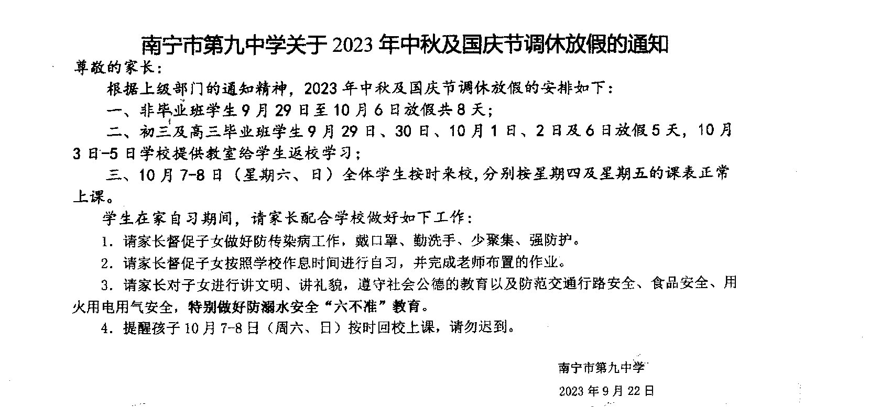

### 行动内容:

1. 向市教育局或自治区教育厅举报学校不遵守[《广西壮族自治区普通高中学校常规管理规定（2023年版）》](http://jyt.gxzf.gov.cn/zfxxgk/zc/gfxwj/t17578675.shtml) (下称 "《规定》")
   1. "严禁法定节假日、寒暑假集中补课或变相补课" (《规定》第六点)

      这个大家懂得都懂, 国庆补课通知啥的都算证据

   2. "确保学生每天睡眠时间达到 8 小时" (《规定》第十二点)

      内宿生晚自习至 22: 50, 23: 00 熄灯, 次日 6: 30 打起床铃, 最迟 7: 00 离开宿舍.
      从 22: 50 到次日 7: 00 共有八小时零十分钟, 也就是说内宿生需要在十分钟内完成: 从教室到宿舍, 排队洗漱, 归寝, 起床才能满足八小时的要求.

      注意: 宿舍分布在二楼到五楼, 最远的班级的内宿生可能需要上下共十一层楼, 经过一个操场才能到达宿舍; 一些班级甚至要求 6: 30 就要到教室.

   3. "学校向学生推荐的教辅材料应在自治区公告的目录内选用推荐" (《规定》第二十六点)
 
      > 未列入自治区教辅推荐目录的其他类教辅材料,由学生或家长自行在市场上购买,学校不得统一征订或提供代购服务,不得要求或暗示家委会统一征订或代购。家委会不得组织自治区教辅推荐目录之外的教辅材料及课外读物征订或代购工作。
      >
      > 教师不得将自治区教辅推荐目录之外的教辅材料指定为学生日常作业或作为日常测试、考试试卷。
      >
      > ([《自治区教育厅 自治区发展改革委 自治区新闻出版局 自治区市场监管局 关于印发《广西壮族自治区2023年秋季中小学教辅推荐目录》的通知》](http://jyt.gxzf.gov.cn/zfxxgk/fdzdgknr/tzgg_58179/t16681469.shtml))

      > 如学校根据学生学习情况需要征订地理、物理、化学、生物学科中考复习资料的，可在学生自愿购买的原则下在《自治区教育厅 自治区发展改革委 自治区新闻出版局 自治区市场监管局关于印发<广西壮族自治区2023年秋季中小学教辅推荐目录>的通知》（桂教教材〔2023〕3号）中的附件1《2023年秋季学期义务教育教辅推荐目录》中征订。
      >
      > 普通高中学校根据学生学习情况需要征订教辅材料的，应在学生自愿购买的原则下从《南宁市2023年秋季学期普通高中教辅推荐目录》中征订；如需征订各学科高考总复习第1、2轮资料的，可在学生自愿购买的原则下从《自治区教育厅 自治区发展改革委 自治区新闻出版局 自治区市场监管局关于印发<广西壮族自治区2023年秋季中小学教辅推荐目录>的通知》（桂教教材〔2023〕3号）中的附件2《2023年秋季学期普通高中教辅推荐目录》中征订。
      >
      > ([《南宁市教育局关于印发2023年秋季学期中小学教辅推荐目录的通知》](https://jy.nanning.gov.cn/xxgk/fdzdgknr/jcjy/jcjfgl/t5632445.html))

      大家可以检查一下自己班要求统一购买 (不管是不是自愿购买, 是不是考试复习资料, 只要是统一买就算) 的教辅书在不在《广西壮族自治区2023年秋季中小学教辅推荐目录》(下称 "《自治区推荐目录》") 或《南宁市2023年秋季学期中小学教辅推荐目录》(下称 "《市推荐目录》") 里, 不在即可举报. 《自治区推荐目录》, 《市推荐目录》可以分别在自治区教育厅官网, 南宁市教育局官网找到, 这里附个链接:

      - 《自治区推荐目录》: http://jyt.gxzf.gov.cn/zfxxgk/fdzdgknr/tzgg_58179/P020230620572077693747.pdf
      - 《市推荐目录》: https://jy.nanning.gov.cn/xxgk/fdzdgknr/jcjy/jcjfgl/P020230706310360542939.xls

      据统计, 某年级违规率达 67%. 其他年级肯定也少不到哪去.

      2023-12-14 更新: 感谢部分匿名同学提供的不在《自治区推荐目录》和《市推荐目录》的教辅:

      - 《名师学案. 高中作文》(庞文苹主编) 天津: 天津科学技术出版社 ISBN 978-7-5576-2010-3
      - 《高考古诗文默写满分突破》(何宗学, 栾春生主编) 北京: 开明出版社 ISBN 978-7-5131-5918-0
      - 《高考试题45套. 数学》(杜志建主编) 南京: 南京师范大学出版社 ISBN 978-7-5651-5189-7
      - 《爱疯英语: 精准备考新思路: 高中版》(蒋小青主编) 长春: 吉林教育出版社 ISBN 978-7-5553-9858-5
      - 《高中全程复习方略. 化学 新教材》(张泉主编) 沈阳: 辽宁少年儿童出版社 ISBN 978-7-5315-8298-4
      - 《高考帮. 生物学》(杜志建主编) 南京: 南京师范大学出版社 ISBN 978-7-5651-5578-9

2. 向市教育局或自治区教育厅举报学校不遵守[《桂教规范〔2023〕6号：自治区教育厅关于加强和改进我区中小学生校服管理工作的通知》](http://jyt.gxzf.gov.cn/zntj/t17303096.shtml) (下称 "《校服通知》") 中 "坚持自愿原则" 的规定, 强制要求学生穿着校服

   > 四、坚持自愿原则
   >
   > 校服具有重要的育人功能,鼓励有条件的地方和学校统一着装上学。学校要切实承担校服管理主体责任,负责校服选用采购工作的组织实施。在校服选购工作中,坚持“两个自愿”原则。一是学校自愿开展。学校组织开展要深入论证,并与广大家长充分沟通确定是否选用校服,如选用校服,须向主管教育行政部门备案。二是学生自愿购买。允许学生按照所在学校校服款式、颜色,自行选购、制作校服,不得以任何方式强制学生购买校服。
   >
   > (《校服通知》)

3. 匿名向校领导邮寄包括但不限于有关九中的表情包, 笑话, 举报证据等, 并附上 "南宁九中学生维权委员会" 字样

   举例:

   - 笑话:

      > “医生，什么办法我们都使用过了，可就是叫不醒他！”
      >
      > “可恶……对了，他是哪个学校的？”
      >
      > “啊？呃……他是九中的”
      >
      > “这就好办了！给我在这孩子的耳朵旁边外放超级马x奥！”

   - 笑话:

      > 一天，领导们在启智楼楼顶俯瞰整个九中（这也是笑话），这时，他们发现在操场的饮水机旁聚集了大量学生等着打水。
      >
      > “如果这时候我向全校广播说要增加九中的饮水机数量，那么学生一定会敬爱我的”
      >
      > 一名领导笑着说
      >
      > 过了一会，他们又看见学校的小卖铺里里外外都挤满了买东西的学生。
      >
      > “如果这时候我向全校广播说要扩建九中的小卖铺，那么学生一定会更敬爱我”
      >
      > 另一名领导说道
      >
      > 又是过了一会，他们看见一名学生因为携带手机进入校园而被老师呵斥
      >
      > “哈哈！如果这时候我向全校广播说允许学生们把手机等电子产品带入校园，那么学生们一定会更加敬爱我！”
      >
      > 第三个领导得意的说，这时在一旁的伊万终于忍不住笑了。
      >
      > “同学，你在笑什么？”
      >
      > 一名领导好奇地问
      >
      > “我不敢说”伊万赶紧收起笑容
      >
      > “放心吧，我们不会处分你的！”三名领导赶紧说道
      >
      > “我在笑，如果这时候我把你们仨丢下去，那么同学们真正敬爱的会是我！”
      >

      (叠个甲，我们并不支持在校内随意使用手机的行为，但主动去翻学生抽屉找手机是真的蠢，这里只是在讽刺校领导爱说不切实际的空话)

      (还有，我们亲爱的伊万被记大过一次)

   - 笑话:

      > 愤怒的学生将九中领导们逼到了墙角
      >
      > “你们可以不用只穿校服了！”
      >
      > 一名领导喊道，但是愤怒的人群没有停下
      >
      > “我们会允许电子产品进入校园！
      >
      > 又一名领导喊道，效果甚微
      >
      > 这时，体育组的一名老师急中生智，大喊道
      >
      > “你们跑操时不用喊那愚蠢的口号啦！”
      >
      > 九中恢复往日的安宁

   - 表情包:

      

   - 举报证据 (《南宁市第九中学关于2023年中秋及国庆节调休放假的通知》):

      

4. 在社交媒体上转发或评论南宁九中官号发布的内容, 提及上述内容和南宁九中学生维权委员会, 并建议初三学生不要选择九中.

### 行动方式:

- 学校地址: 广西壮族自治区南宁市兴宁区人民东路 230 号 (邮寄纸质信仅需 8 毛, 贴好邮票扔进邮筒即可; 邮编: `530012`)
- 校微信公众号: `NNJZ1956`
- 校微博: [广西南宁市第九中学](https://weibo.com/u/3233324784)
- 校抖音: [南宁市第九中学](https://www.douyin.com/user/MS4wLjABAAAAKLET1YYCuL1Xp7yNG_G-ShEUxqGEatia7KM97gvX1J2VoR_ZwO0Xm61wQaL3j4CK) 抖音号: `66861670550`
- 校政教处电子邮箱: [nnjzzjc@126.com](mailto:nnjzzjc@126.com) (可使用匿名邮箱等)
- 校办公室电子邮箱: [nnjzbgs@163.com](mailto:nnjzbgs@163.com) (可使用匿名邮箱等)
- `12345` 政务服务便民热线 (强烈建议不要透露真实姓名等信息, 可以让外省, 他校的同学帮忙, 外省记得加区号 `0771`)
- 市教育局电子邮箱: [2804643@163.com](mailto:2804643@163.com) (推荐, 但效果未知; 可使用匿名邮箱等)
- 自治区教育厅电话: `0771-5815000` (可让外省同学帮忙或使用虚拟电话号码等)
- [市教育局政民互动](https://hd.nanning.gov.cn/wcm/govrefer2/wyxx/refer.html) (需实名, 不建议)
- [自治区教育厅厅长信箱](http://jyt.gxzf.gov.cn/wmhd/tzxx/) (需实名, 不建议)

匿名邮箱推荐:

- [Protonmail](https://www.protonmail.com/)
- [Secmail](https://www.secmail.com/)

---

**南宁市第九中学学生维权委员会**

NN9Z Student Rights Protection Committee

邮箱: [NNJZSRPC@proton.me](mailto:NNJZSRPC@proton.me)

官网: [NNJZSRPC.github.io](https://NNJZSRPC.github.io/)

(提示: 邮箱与域名均不区分大小写, 链接 (URL) 一般不区分大小写)